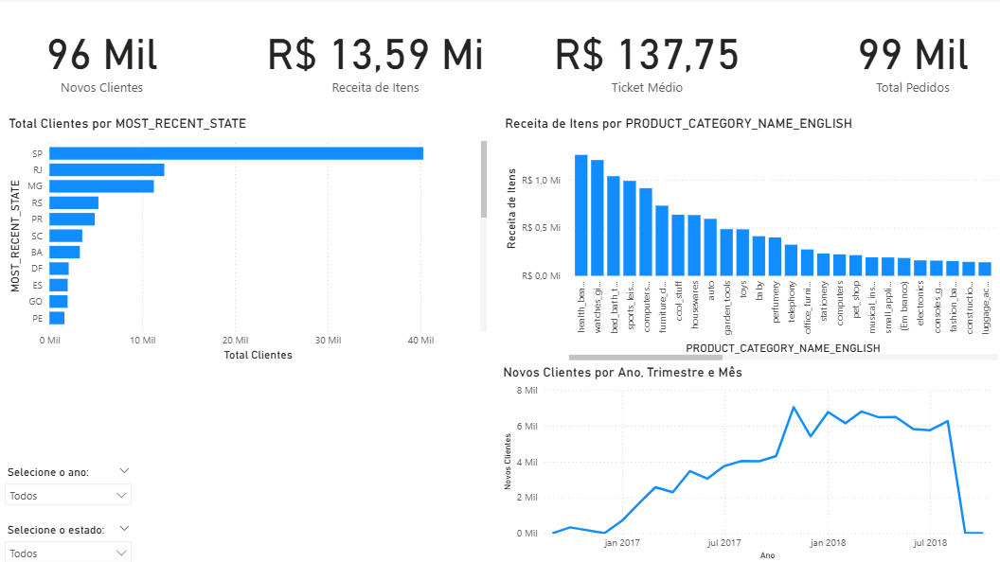
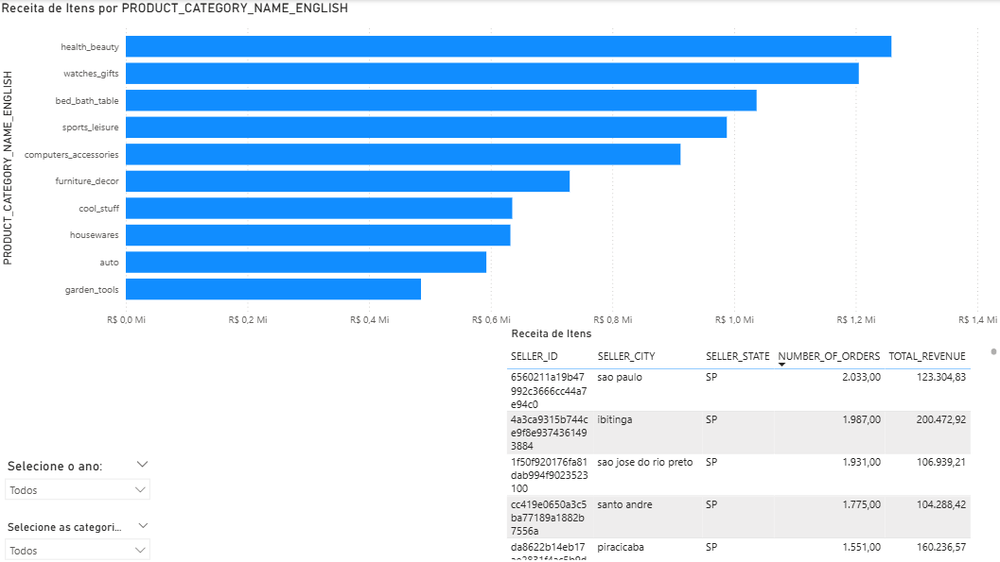
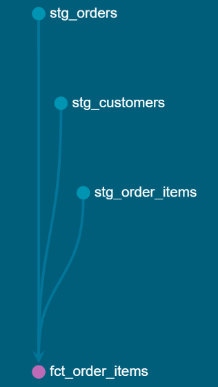
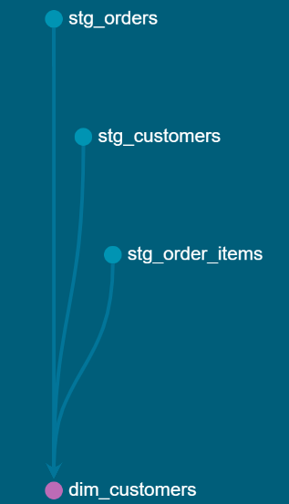
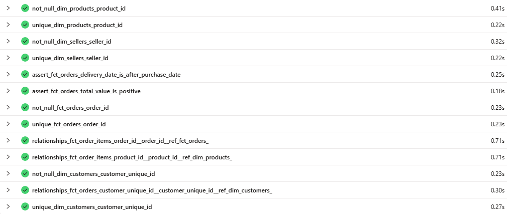

# Projeto de Engenharia de Dados: Pipeline de Vendas Olist

## 🎯 Visão Geral do Projeto
Este projeto implementa um pipeline de dados completo (end-to-end), desde a ingestão de dados brutos em arquivos CSV até a criação de um dashboard analítico interativo no Power BI. O objetivo foi aplicar as melhores práticas de engenharia de dados utilizando uma stack moderna com Snowflake, dbt e Power BI, simulando um ambiente corporativo real com o dataset de e-commerce da Olist.

Este repositório serve como um portfólio prático, demonstrando competências em modelagem de dados (Arquitetura Medallion, Esquema Estrela), transformação, testes de qualidade de dados e visualização de insights de negócio.

## 🛠️ Ferramentas e Tecnologias
| Ferramenta | Propósito |
| :--- | :--- |
| **Snowflake** | Cloud Data Warehouse para armazenamento e processamento dos dados. |
| **dbt (Data Build Tool)** | Ferramenta de transformação (o 'T' do ELT), usada para modelar, testar e documentar os dados. |
| **Power BI** | Ferramenta de Business Intelligence para visualização de dados e criação do dashboard. |
| **Git & GitHub** | Sistema de versionamento de código e hospedagem do projeto. |

## 🏗️ Arquitetura da Solução
A solução foi construída seguindo a arquitetura **Medallion**, garantindo governança e qualidade dos dados em cada etapa do pipeline.

* **Bronze (RAW):** Cópia fiel dos dados brutos, garantindo um backup imutável da fonte.
* **Silver (Staging):** Os dados são limpos, padronizados, com tipos de dados corrigidos e renomeação de colunas.
* **Gold (Marts):** A camada final, onde os dados são agregados e modelados em um Esquema Estrela, com tabelas Fato e Dimensão otimizadas para análise.

## 📊 Dashboard de Resultados
O resultado de todo o pipeline é um dashboard com duas páginas que fornecem uma visão completa do negócio.

*(Pode levar alguns segundos para o dashboard carregar completamente)*

### Página 1: Análise Geral de Vendas

### Página 2: Análise de Produtos e Vendedores

## 📈 Linhagem de Dados (dbt)
A documentação gerada pelo dbt (`dbt docs`) fornece um gráfico de linhagem de dados (DAG) que mostra visualmente como os modelos se conectam, desde as fontes brutas até as tabelas finais, garantindo total rastreabilidade e governança.

<h4>Linhagem de Dados (DAG)</h4>

O gráfico de linhagem gerado pelo <code>dbt docs</code> mostra visualmente como os modelos se conectam, desde as fontes brutas até as tabelas finais, garantindo total rastreabilidade.

<table align="center">
  <tr>
    <td align="center"><b>Linhagem da Tabela Fato Principal</b></td>
    <td align="center"><b>Linhagem da Dimensão de Clientes</b></td>
  </tr>
  <tr>
    <td></td>
    <td></td>
  </tr>
</table>

#### Testes de Qualidade
O projeto inclui um conjunto de testes de dados para garantir a integridade, unicidade e lógica de negócio dos modelos finais, validando a confiabilidade do pipeline.

## 🚀 Próximos Passos (Fase 2)
Como uma evolução deste projeto, os seguintes passos estão planejados:
* **Automação e Orquestração:** Integrar o pipeline com o **Apache Airflow** para automatizar as execuções diárias.
* **Ingestão de Dados via API:** Desenvolver um processo para complementar os dados existentes com informações de uma API externa.
* **Análise de Cohort:** Implementar um visual de Análise de Cohort no Power BI para medir a retenção de clientes mês a mês.
* **Materialização Incremental:** Alterar a materialização dos modelos da camada Gold para `incremental` para otimizar os custos e o tempo de execução em um ambiente de produção.
